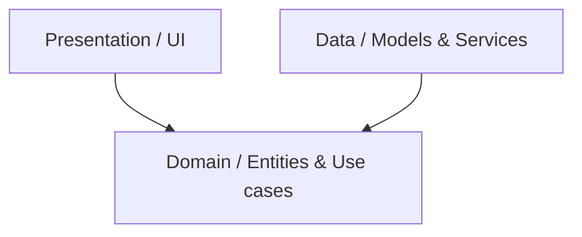

# Clean Architecture Standards

Detailed decoupling guidelines for core system layers.

## Core Decoupling Rule

The **Domain** layer must not depend on any third-party framework, SDK, or database.

## Models vs. Entities
- **Entity**: Resides in the Domain layer. Represents the core business object with business rules.
- **Model**: Resides in the Data layer. Extends or maps the Entity and implements JSON deserialization/serialization (`fromJson`, `toJson`).
