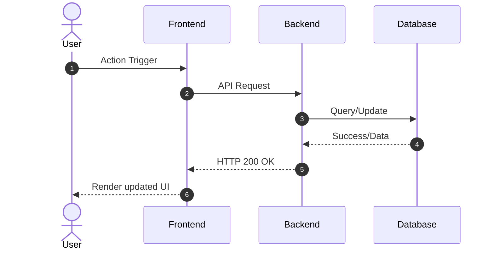

# Sequence Diagram Template

This document provides a template sequence diagram for system actions.

```mermaid
sequenceDiagram
    autonumber
    actor User
    participant Frontend
    participant Backend
    participant Database

    User->>Frontend: Action Trigger
    Frontend->>Backend: API Request
    Backend->>Database: Query/Update
    Database-->>Backend: Success/Data
    Backend-->>Frontend: HTTP 200 OK
    Frontend-->>User: Render updated UI
```
