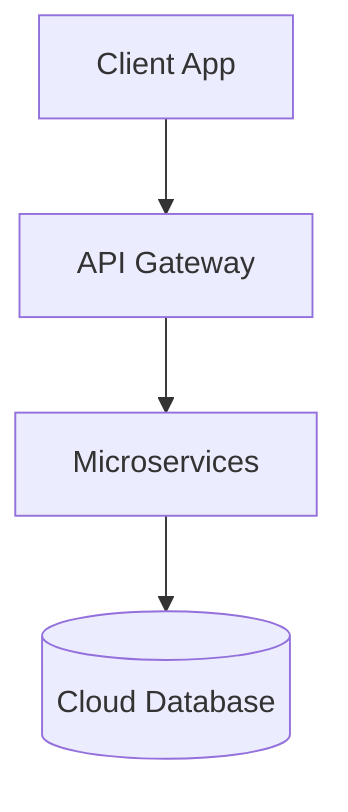

# System Overview: [System Name]

- **Status**: [Proposed / In Development / Active / Deprecated]
- **Version**: [System Version]

## 🎯 Scope & Context
High-level summary of the system, its objectives, and key stakeholders.

## 📐 High-Level Architecture
Provide a description of layers, frameworks, and deployment instances.

## 🔄 Core Integrations
List third-party integrations (e.g. payments, maps, notifications).
